# Project 2
## LEMP stack implementation

Create  a new instance on AWS

INSTALLING NGINX WEB SERVER

`sudo apt update`

`sudo apt install ngnix`

`sudo apt upgrade`

`sudo systemctl status nginx`

open inbound connection to port 80

curl http://localhost:80

`curl http://127.0.0.1:80`

[Testing nginx server response to requests from the internet](http://3.71.15.205/)

`curl -s http://169.254.169.254/latest/meta-data/public-ipv4`

INSTALLING MYSQL 

`sudo apt install msql-server`

`sudo mysql`

`ALTER USER 'root'@'localhost' IDENTIFIED WITH mysql_native_password BY 'PassWord.1';`

run interactive script pre-installed with mysql to remove insecure settings and lockdown access to database

`sudo mysql_secure_installation`

test login in into mysql console

`sudo mysql -p`

exit mysql console with command "exit"

INSTALLING PHP to process code and generate dynamic content for the webserver

`sudo apt install php-fpm php-msql`

CONFIGURING NGINX TO USE PHP PROCESSOR

create root web directory for your domain as follows

`sudo mkdir /var/www/projectLEMP`

assign ownership of the directory with the $USER environment table

`sudo chown -R $USER:$USER /var/www/projectLEMP`

open configuration file in nginx sites-available using command line editor (NANO)

Activate your configuration by linking to the config file from Nginx’s sites-enabled directory

`sudo ln -s /etc/nginx/sites-available/projectLEMP /etc/nginx/sites-enabled/`

test configuration for syntax errors

`sudo nginx -t`

disable default nginx host currently configured to listen on port 80

`sudo unlink /etc/nginx/sites-enabled/default`

reload nginx

`sudo systemctl reload nginx`

test new server block by  creating an index.html file in location /var/www/projectLEMP

`sudo echo 'Hello LEMP from hostname' $(curl -s http://169.254.169.254/latest/meta-data/public-hostname) 'with public IP' $(curl -s http://169.254.169.254/latest/meta-data/public-ipv4) > /var/www/projectLEMP/index.html`

open url in browser

accessing website with public DNS name

TESTING PHP WITH NGINX

Test to validate that Nginx can correctly hand .php files off to your PHP processor. Do this by creating a test PHP file in your document root.

`sudo nano /var/www/projectLEMP/info.php`

paste code in nano editor

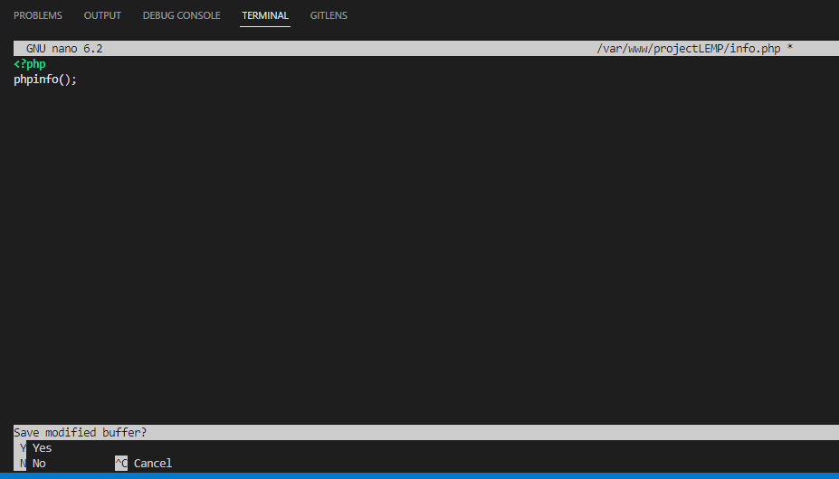

access page on browser followed by /info.php

[accesing page on browser followed by /info.php](http://3.73.130.171/info.php)

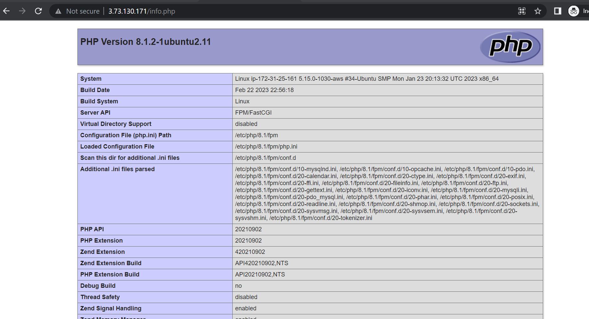

remove file created on php server as it contains sensitive information about php environment

`sudo rm /var/www/your_domain/info.php`

RETRIEVING DATA FROM MYSQL DATABASE WITH PHP (CONTINUED)

Connect to mysql console using root account

`sudo mysql -p`

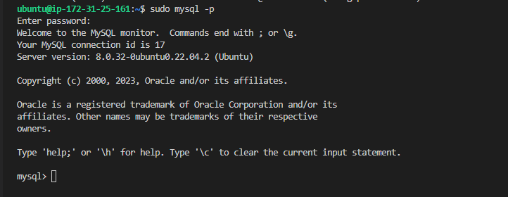

Create a new database called example_database by running command below in mysql console

`CREATE DATABASE `example_database`;`

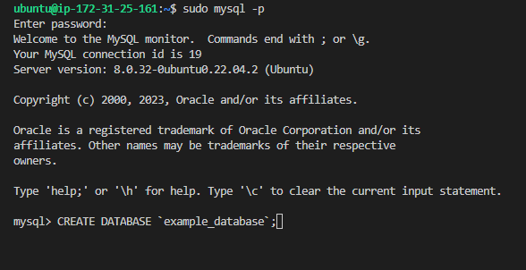

create a new user

`CREATE USER 'example_user'@'%' IDENTIFIED WITH mysql_native_password BY 'password';`

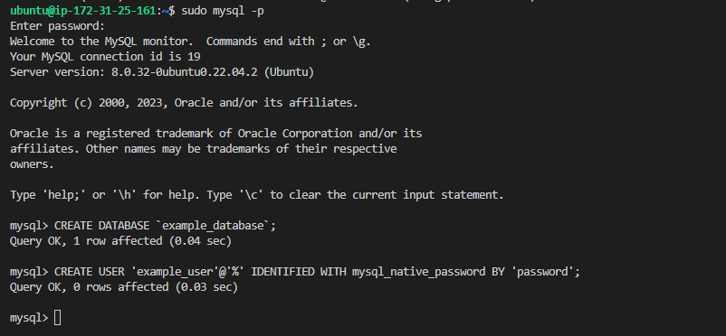

grant new user full previledges

`GRANT ALL ON example_database.* TO 'example_user'@'%';`

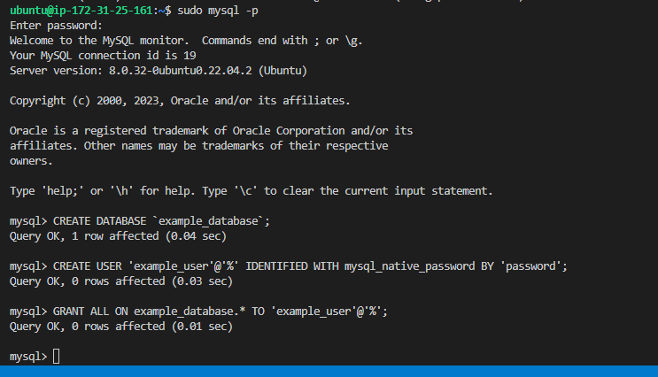

exit mysql console

`exit`

test if new user has proper permissions by logging into MySql console again

`mysql -u example_user -p`

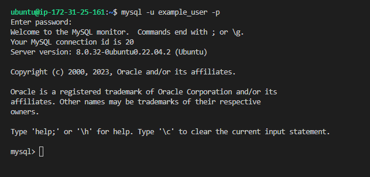

confirm that you have access to database as example_user

`SHOW DATABASES;`

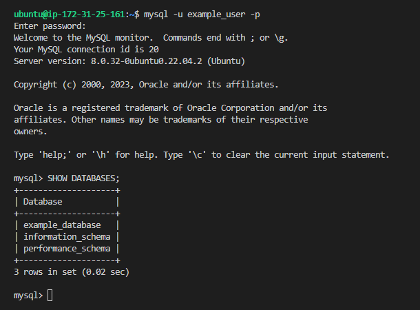

create a table named todo_list

`CREATE TABLE example_database.todo_list(item_id INT AUTO_INCREMENT, content VARCHAR(255), PRIMARY KEY(item_id));`

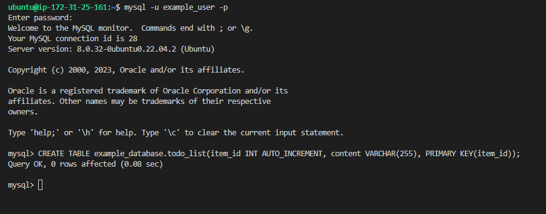

Insert few rows of content in table named todo_list

`INSERT INTO example_database.todo_list (content) VALUES ("My first important item");`

`INSERT INTO example_database.todo_list (content) VALUES ("My second important item");`

`INSERT INTO example_database.todo_list (content) VALUES ("My third important item");`

`INSERT INTO example_database.todo_list (content) VALUES ("My fourth important item");`

`INSERT INTO example_database.todo_list (content) VALUES ("My fifth important item");`

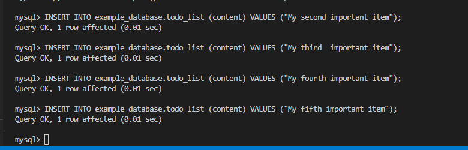

confirm that data inserted was properly saved

`SELECT * FROM example_database.todo_list;`

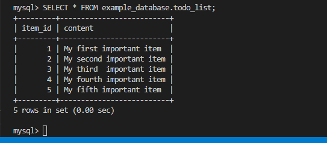

`exit`

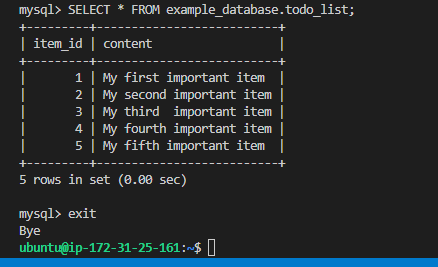

create a PHP script that will connect to MySQL and query for your content

Create a new PHP file in your custom web root directory using your preferred editor

`nano /var/www/projectLEMP/todo_list.php`

Paste the following PHP script connects to the MySQL database and queries for the content of the todo_list table, displays the results in a list

<?php
$user = "example_user";
$password = "password";
$database = "example_database";
$table = "todo_list";

try {
  $db = new PDO("mysql:host=localhost;dbname=$database", $user, $password);
  echo "<h2>TODO</h2><ol>";
  foreach($db->query("SELECT content FROM $table") as $row) {
    echo "<li>" . $row['content'] . "</li>";
  }
  echo "</ol>";
} catch (PDOException $e) {
    print "Error!: " . $e->getMessage() . " ";
    die();
}

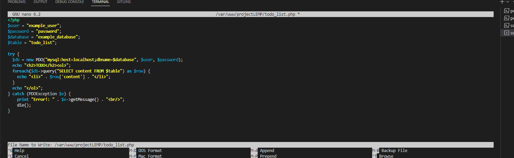

access webpage by visiting domain name or public IP address configured for the website followed by/todo_list.php

[accessing webpage](http://3.73.130.171/todo_list.php)

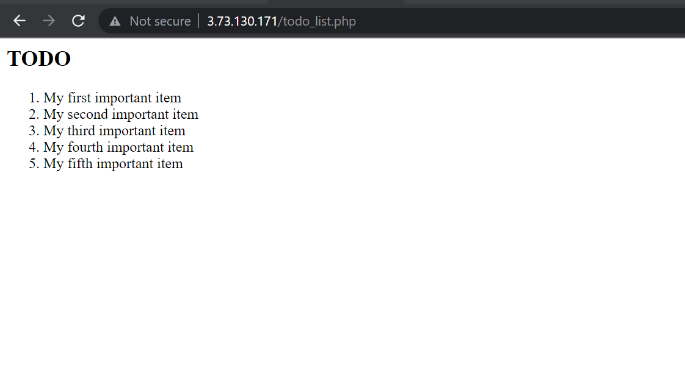

