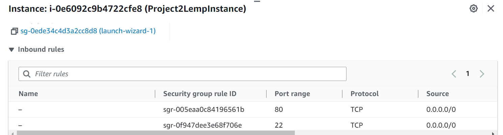
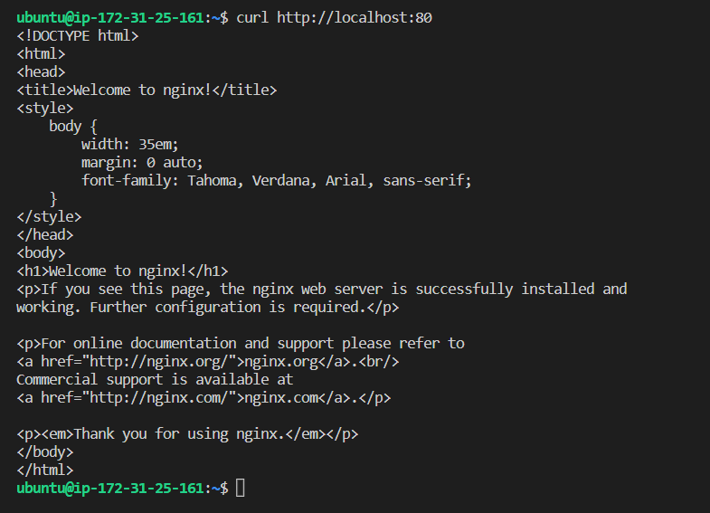

# Project 2
## LEMP stack implementation

Create  a new instance on AWS

INSTALLING NGINX WEB SERVER

`sudo apt update`

`sudo apt install ngnix`

`sudo apt upgrade`

`sudo systemctl status nginx`

open inbound connection to port 80

curl http://localhost:80

`curl http://127.0.0.1:80`

[Testing nginx server response to requests from the internet](http://3.71.15.205/)

`curl -s http://169.254.169.254/latest/meta-data/public-ipv4`

INSTALLING MYSQL 

`sudo apt install msql-server`

`sudo mysql`

`ALTER USER 'root'@'localhost' IDENTIFIED WITH mysql_native_password BY 'PassWord.1';`

run interactive script pre-installed with mysql to remove insecure settings and lockdown access to database

`sudo mysql_secure_installation`

test login in into mysql console

`sudo mysql -p`

exit mysql console with command "exit"

INSTALLING PHP to process code and generate dynamic content for the webserver

`sudo apt install php-fpm php-msql`

CONFIGURING NGINX TO USE PHP PROCESSOR

create root web directory for your domain as follows

`sudo mkdir /var/www/projectLEMP`

assign ownership of the directory with the $USER environment table

`sudo chown -R $USER:$USER /var/www/projectLEMP`

open configuration file in nginx sites-available using command line editor (NANO)

Activate your configuration by linking to the config file from Nginx’s sites-enabled directory

`sudo ln -s /etc/nginx/sites-available/projectLEMP /etc/nginx/sites-enabled/`

test configuration for syntax errors

`sudo nginx -t`

disable default nginx host currently configured to listen on port 80

`sudo unlink /etc/nginx/sites-enabled/default`

reload nginx

`sudo systemctl reload nginx`

test new server block by  creating an index.html file in location /var/www/projectLEMP

`sudo echo 'Hello LEMP from hostname' $(curl -s http://169.254.169.254/latest/meta-data/public-hostname) 'with public IP' $(curl -s http://169.254.169.254/latest/meta-data/public-ipv4) > /var/www/projectLEMP/index.html`

open url in browser

accessing website with public DNS name

